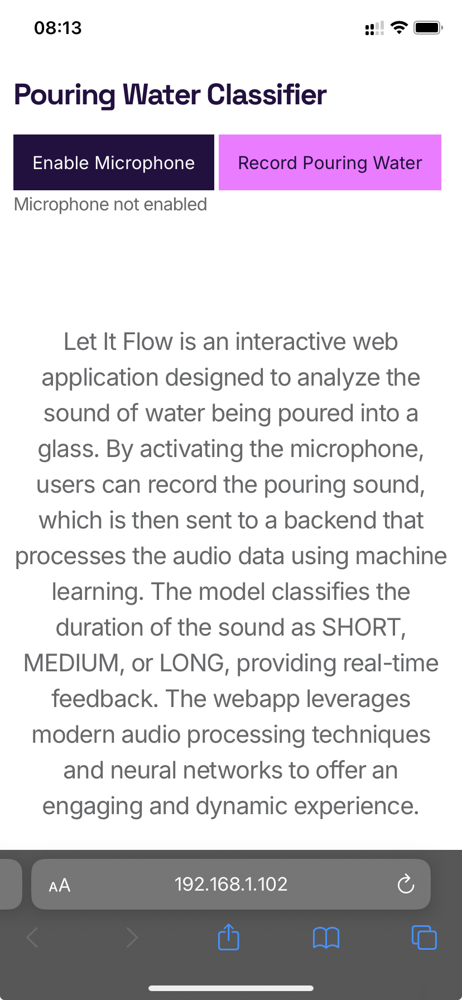
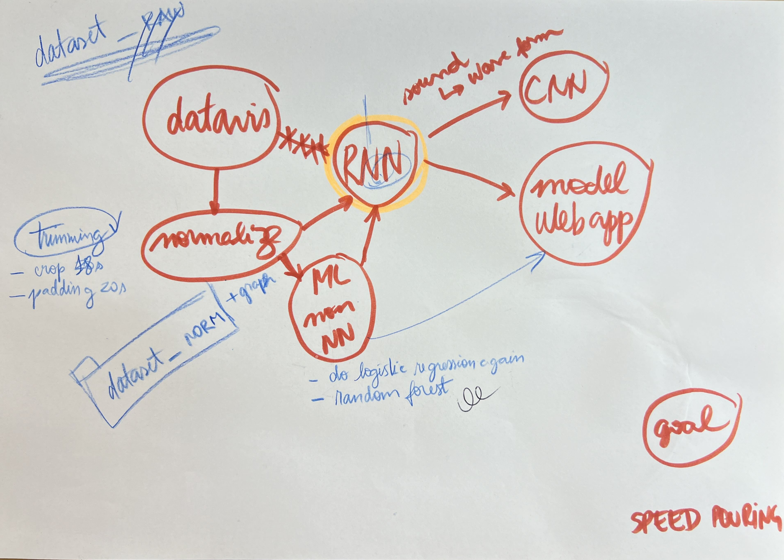

# Let It Flow 
## A little bit about "Let it Flow"
The goal is to train a machine learning model from a custom dataset of water pouring sounds. The final system will generate sound triggers based on the pouring speed, potentially creating an orchestral experience in a collaborative web app where multiple users can interact simultaneously.
1. The idea is to create our own database of the sounds.
2. We need to use Pytorch with NN to create our model.
3. The goal is having some values in the and to use as controller or trigger of music.

## How to see the process
To follow the process, you can see the notebook Let_it_flow_rra.ipynb that tells more or less the steps that we followed.

